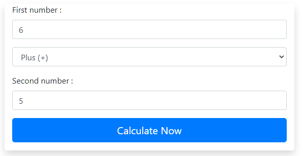
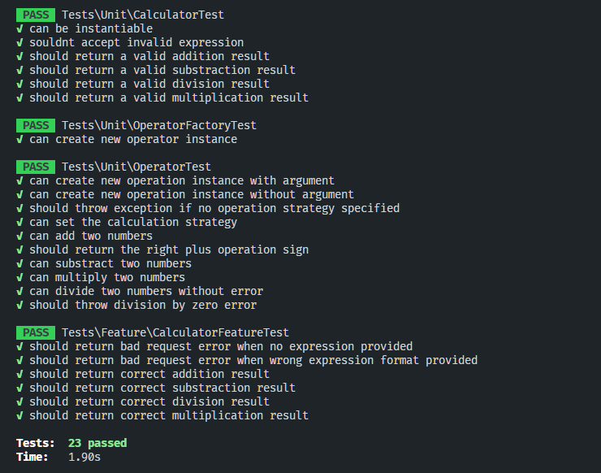

# Laravel Calculator (Technical Test)

### Test requirements

create a simple calculator that can handle the following calculation types: plus, minus, multiplication, division.
Your code should at least include a route to access the calculator page (e.g. /calculator), a controller to render the template and a very basic template for the form.

## Project Key Metrics

- Laravel v9.0
- Frontend: Vue js 3

## Important Files / Folders

[app/Services/Calculator ⇨ ](https://github.com/OMARIZEM/laravel-calculator/tree/main/app/Services/Calculator)

[app/Factories ⇨ ](https://github.com/OMARIZEM/laravel-calculator/tree/main/app/Factories)

[app/Http/Controllers/CalculatorController.php ⇨ ](https://github.com/OMARIZEM/laravel-calculator/blob/main/app/Http/Controllers/CalculatorController.php)

[tests/Unit ⇨ ](https://github.com/OMARIZEM/laravel-calculator/tree/main/tests/Unit)

[tests/Feature ⇨ ](https://github.com/OMARIZEM/laravel-calculator/tree/main/tests/Feature)

## Frontend Screenshot



## Api specifications

Endpoint: `https://domain.com/api/calculator`

Method: `POST`

## Parameters

| Param Name   | Param Type | Description                    | Required |
| ------------ | ---------- | ------------------------------ | -------- |
| `expression` | string     | Arithmetic expression like 2+6 | yes      |

## Response

[200] OK

```json
{
  "success": true,
  "data": {
        "expression": "-2+8",
        "result": 6
    },
}
```

[422] Validation Error 

```json
{
    "success": false,
    "message": "expression should be a valid arithmetic expression",
    "errors": {
        "expression": [
            "expression should be a valid arithmetic expression"
        ]
    }
}
```

[500] Error 

```json
{
    "success": false,
    "message": "An internal Error occured.",
    "errors": []
}
```

## Setup Project

```bash
# clone the repo
git clone https://github.com/OMARIZEM/laravel-calculator.git

cd laravel-calculator

# install composer dependencies
composer install

# install npm dependencies
npm install

# create a environment file
cp .env.example .env

# open .env file and change the APP_URL
MIX_APP_URL=YOUR_URL_HERE

# set the Application key
php artisan key:generate

# run the artisan server
php artisan server

# build the app
npm run dev or npm run watch
```


## Tests

```bash
# To run tests use
php artisan test
```



## Contact info

if you have any questions feel free to contact me here: [contact@izem.dev ](mailto:contact@izem.dev)
